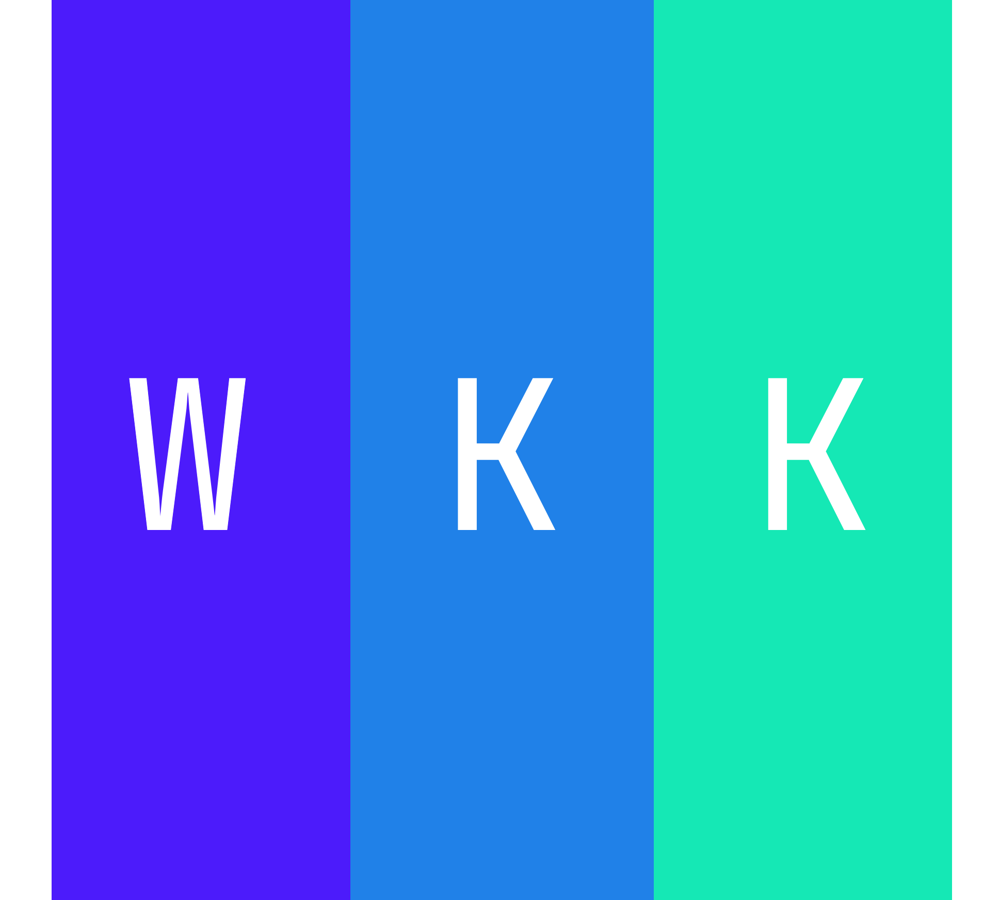

# 配置

## 博客信息

博客名称：低洼萝卜

网站描述：纯展示：软件 · 论文 · 照片 · 所见所得等外链跳转
> SEO专用

网站图标：

标语：去吧！皮卡丘！

版权：© 2026 低洼萝卜

## 作者信息

姓名：低洼萝卜

头像：

Email：<kekewu0925@gmail.com>

Github：[CarrotWuDev](https://github.com/CarrotWuDev)

标签：开发者、哲学、设计、深度学习、探险家、服务行业从业人员

## 展示类别

### 独立开发者

样式类型: project
> 指定样式类型为`project`

展示序号：1

强调色：#2563eb

链接：[独立开发者配置文件路径](../contents/独立开发者.md)

### 游戏

样式类型: game
> 指定样式类型为`game`

展示序号：2

强调色：#dc2626

链接：[游戏配置文件路径](../contents/游戏.md)

### 照片

样式类型: photo
> 指定样式类型为`photo`

展示序号：3

强调色：#ea580c

链接：[照片配置文件路径](../contents/照片.md)

### 读书

样式类型: book
> 指定样式类型为`book`

展示序号：4

强调色：#10b981

链接：[读书配置文件路径](../contents/读书.md)

### 日记

样式类型：diary
> 指定样式类型为`diary`

展示序号：5

强调色：#8b5cf6

链接：[日记配置文件路径](../contents/日记.md)

### 音乐

样式类型：music

展示序号：6

强调色：#1DB954

链接：[音乐配置文件路径](../contents/音乐.md)
